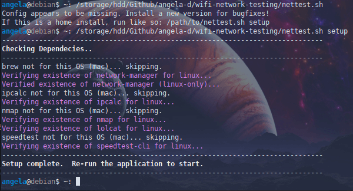
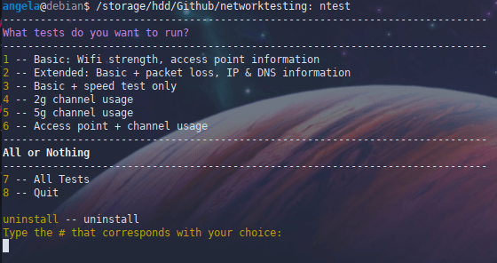
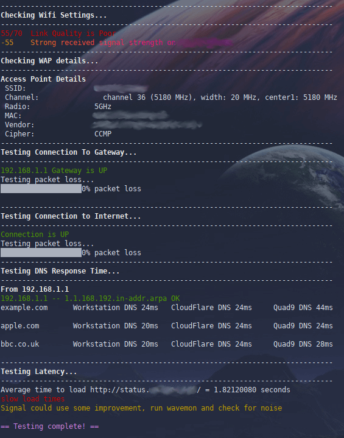
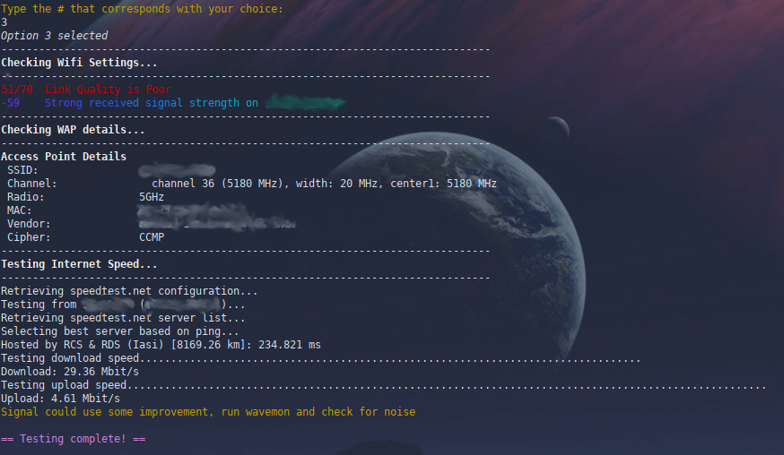
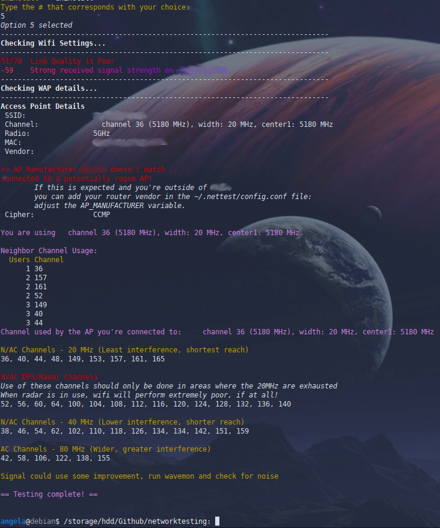
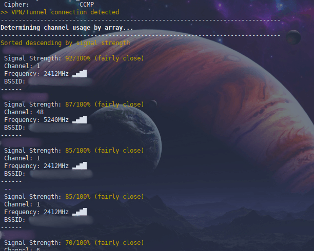
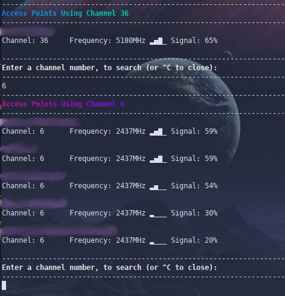

# Wifi Network Testing
Scan your wifi network and obtain troubleshooting details, with extreme granularity; using a colorful command-line tool with no technical skill necessary.   (Assuming you are familiar with git, of course.)

**Obtain the following details about your wifi connection**:

Wifi statistics:
- SSID / wifi name / access point / router name you're connected to
- MAC address & manufacturer details
- Channel details; connection cipher/encryption for your connection
- Neighbor details:
  - Nearby router / access point signal strength (in relation to you)
  - Their router MAC & chip manufacturer info
  - SSID (wifi name) and overall neighbor channel utilization
  - What channel each router or AP is using
  - How many routers/APs total are on that channel

Connectivity assessments:
- Connection detection
- Speed tests & packet loss
- IP & DNS information
- VPN detection

**Optional, built-in enterprise capabilities:**

Useful in scenarios where you're in a multi-access point environment; several APs carrying the same SSID but are posted in different locations throughout your campus.

- Determine whether or not you're on your organization's network / intranet
- Assign custom AP names to access points/routers at your organization (useful when determining which access point in your building is causing issues, such as channel overlap or evil twin attacks)

**Compatible Operating Systems**

| OS            | Pre-prerequisite | Auto-Install (if not already in-use)?                     |
| ------------- |:----------------:| ---------------------------------:|
| Debian-based Linux | network-manager/nmcli | :ballot_box_with_check: |
| MacOS              | brew                  | :ballot_box_with_check: |
| Windows 10         | Git, Bash             | :x: [[details]](https://github.com/angela-d/wifi-network-testing/wiki/Windows-Install)                |

### Screenshots

| Test Option / Install Step            | Image |
| ------------- |:----------------:|
| Initial Setup |  |
| Main Menu |  |
| #2 (Extended: Basic + packet loss, IP & DNS information) |  |
| #3 (Basic + speed test only) |  |
| #5 (5g channel usage) |  |
| #6 (Access point + channel usage) - appearance varies by OS; Linux looks the coolest |  |
| Channel lookup (Linux only) |  |

### How to Install
- [First Run Steps](https://github.com/angela-d/wifi-network-testing/wiki/First-Run/) - How to install and use wiki

### Useful Companion Apps (optional)
If you find this tool useful, you might also find these handy (both are currently for Linux only):
- [wavemon](https://github.com/uoaerg/wavemon) - ncurses-based monitoring application for wireless network devices on Linux
- [wifi-channel-watcher](https://github.com/angela-d/wifi-channel-watcher) - Monitor channel usage of neighboring routers/access points & get an alert if your active channel is not optimal

### Known Bugs
There's a few [cosmetic bugs](https://github.com/angela-d/wifi-network-testing/wiki/Known-Bugs/) that don't affect performance.

### Credits
Original iteration of this application was written by my super cool boss.

I added cross-platform capabilities + enterprise AP customization, MAC lookups and channel details.
