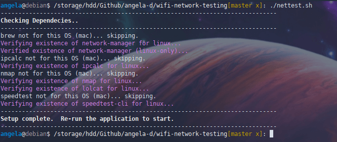

# Wifi Network Testing
Scan your wifi network and obtain troubleshooting details, with extreme granularity.

**Obtain the following details**:

Wifi:
- Access point/router name you're connected to / SSID
- Access point/router MAC of the AP you're connected to
- Channel details; connection cipher/encryption type
- Nearby router/access point details; strength & MAC info, SSID and neighbor channel utilization

Connectivity:
- Connection detection with ping
- Speed tests & packet loss
- IP & DNS information
- VPN detection

**Optional, built-in enterprise capabilities:**
- Determine whether or not you're on your organization's network / intranet
- Assign custom AP names to access points/routers at your organization (useful when determining which access point in your building is causing issues, channel overlap or evil twin attacks)

**Compatible Operating Systems**

| OS            | Pre-prerequisite | Auto-Install (if not already in-use)?                     |
| ------------- |:----------------:| ---------------------------------:|
| Debian-based Linux | network-manager/nmcli | :ballot_box_with_check: |
| MacOS              | brew                  | :ballot_box_with_check: |
| Windows 10         | Git, Bash             | :x: [[details]](https://github.com/angela-d/wifi-network-testing/wiki/Windows-Install)                |

### Screenshots

| Test Option / Install Step            | Image |
| ------------- |:----------------:|
| Initial Setup (enterprise) |  |
| Initial Setup (home) |  |
| Main Menu |  |
| #2 (Extended: Basic + packet loss, IP & DNS information) |  |
| #3 (Basic + speed test only) |  |
| #5 (5g channel usage) |  |
| #6 (Access point + channel usage) - appearance varies by OS; Linux looks the coolest |  |

### How to Install
Setup instructions:
- [Home use](https://github.com/angela-d/wifi-network-testing/wiki/Home-Install/) - Single user setup
- [Enterprise use](https://github.com/angela-d/wifi-network-testing/wiki/Enterprise-Install) - Client machines can pull your codebase from your custom repo

### Useful Companion Apps
- [wavemon](https://github.com/uoaerg/wavemon) - ncurses-based monitoring application for wireless network devices on Linux
- [wifi-channel-watcher](https://github.com/angela-d/wifi-channel-watcher) - Monitor channel usage of neighboring routers & get an alert if your active channel is not optimal

### Known Bugs
- Test # 6 (Access point + channel usage) - any neighboring AP with a space in their SSID (commonly consumer printers) will trigger bash warnings, but will not prevent the script from fully executing
- Needs linting; some shellcheck specifications broke things on Mac, so additional testing is necessary when cleaning

### Credits
Original iteration of this application was written by my super cool boss.

I added cross-platform capabilities + enterprise AP customization, MAC lookups and channel details.
